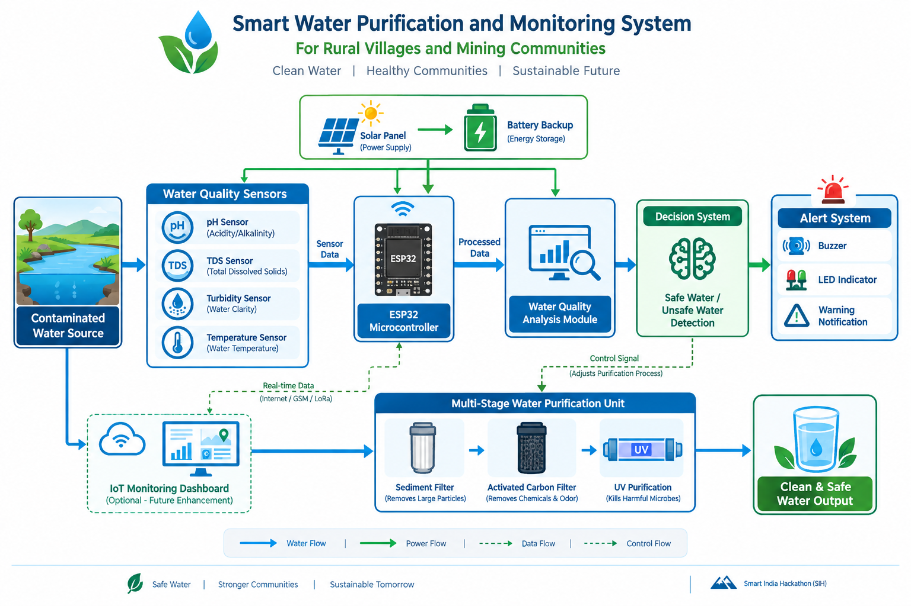

# AquaRakshak
### Smart Water Purification and Monitoring System for Rural Villages and Mining Communities

---

## 🔗 Quick Access

🎥 **Prototype Demonstration Video**  
[Watch Prototype Video](https://drive.google.com/file/d/1zyKh2gSHGMkNvUPFFl_r0g3huaVI9ypP/view?usp=drivesdk)

📑 **Project Presentation (PPT)**  
Available in the `docs/PPT` directory

🏆 **Competition**  
Smart India Hackathon (SIH) 2026

---

## 🏗️ System Architecture

---

## 🌍 Problem Statement

Rural villages and mining communities often face challenges in accessing safe drinking water due to contamination, inadequate monitoring, and lack of sustainable treatment solutions.

---

## 💡 Proposed Solution

AquaRakshak is an IoT-enabled smart water purification and monitoring system that continuously analyzes water quality using real-time sensors and automatically supports purification and alert mechanisms to ensure safe water access.

---

## ✨ Key Features

- Real-time water quality monitoring
- pH, TDS, Turbidity, and Temperature sensing
- ESP32-based intelligent control system
- Automated alert and warning system
- Solar-powered operation with battery backup
- Multi-stage water purification
- Optional IoT dashboard for remote monitoring

---

## 🛠️ Technology Stack

### Hardware
- ESP32 Microcontroller
- pH Sensor
- TDS Sensor
- Turbidity Sensor
- Temperature Sensor
- Solar Panel & Battery Backup
- Water Purification Unit

### Software
- IoT Monitoring Dashboard
- Data Analysis Module
- Alert & Notification System

---

## 👥 Team Members

| Name | Role |
|--------|--------|
| SK. Khaja Hussain | Team Lead |
| Sameera | Team Member |
| Sumanjali | Team Member |
| Mounika | Team Member |
| Bhargavi | Team Member |
| Praveen | Team Member |

---

## 🎯 Vision

**Safe Water • Healthy Communities • Sustainable Future**
